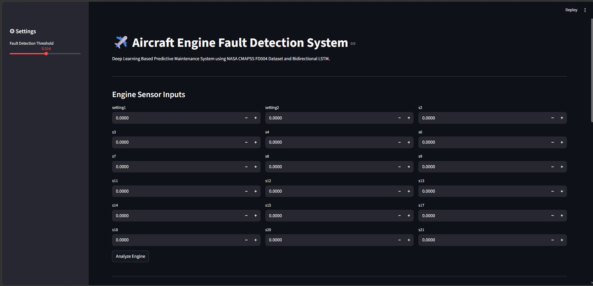
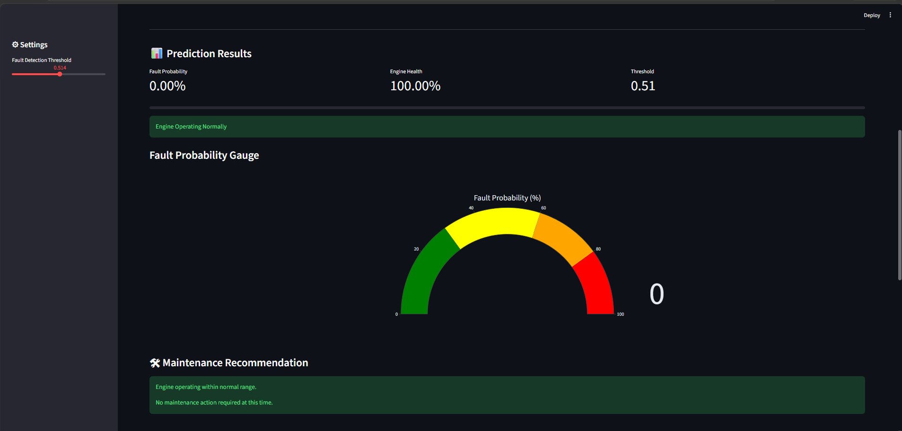
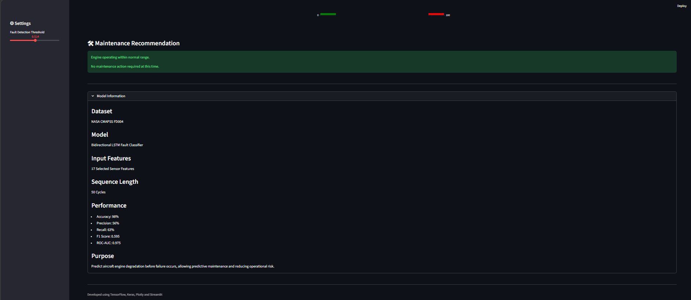
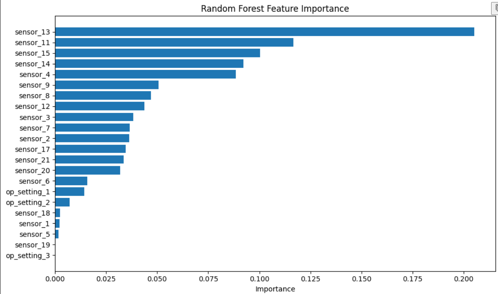
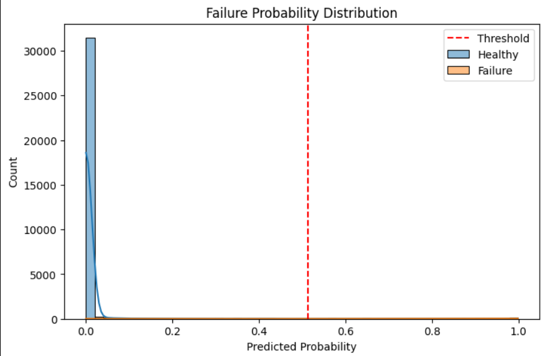
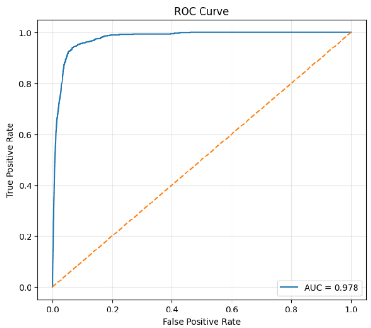
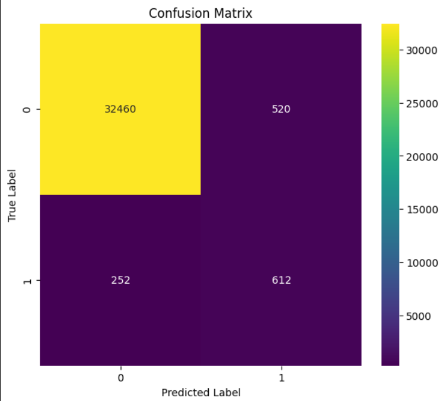
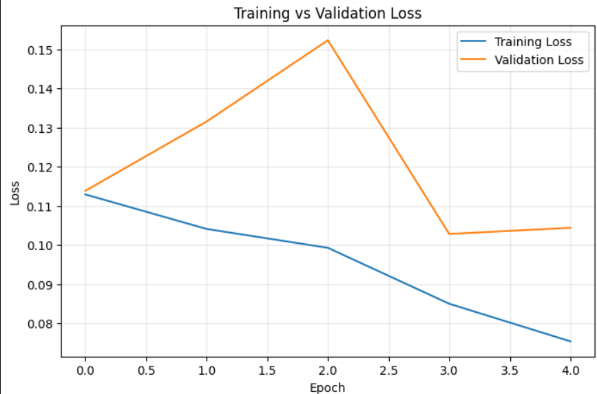

# Aircraft Engine Fault Detection using Deep Learning

A Deep Learning-based Predictive Maintenance System for Aircraft Engines using the NASA CMAPSS FD004 dataset.

This project presents an end-to-end predictive maintenance solution that uses a Bidirectional Long Short-Term Memory (BiLSTM) classifier to analyze multivariate aircraft engine sensor data and predict whether an engine is approaching failure. The system combines data preprocessing, feature selection, sequence modeling, threshold optimization, and an interactive Streamlit dashboard for real-time engine health assessment.

---

# Project Overview

Aircraft engines operate under extreme environmental and mechanical conditions. Continuous operation gradually degrades engine components, increasing the risk of unexpected failures. Predictive maintenance aims to identify degradation early so that maintenance can be scheduled before catastrophic failures occur.

Unexpected engine failures may lead to:

- Increased maintenance costs
- Flight delays and cancellations
- Reduced aircraft availability
- Operational inefficiencies
- Potential safety risks

The objective of this project is to develop a deep learning model capable of detecting engines approaching failure using historical sensor measurements collected throughout the engine lifecycle.

Unlike traditional Remaining Useful Life (RUL) regression models, this project formulates the problem as a binary classification task by converting RUL values into healthy and failure-risk classes.

---

# Project Objectives

The major objectives of this project include:

- Analyze aircraft engine degradation data
- Perform exploratory data preprocessing
- Generate Remaining Useful Life (RUL)
- Convert RUL into binary fault labels
- Select the most informative engine features
- Build a Bidirectional LSTM classifier
- Optimize classification threshold
- Evaluate model performance using multiple metrics
- Deploy the trained model through a Streamlit dashboard

---

# Dataset

## NASA CMAPSS Turbofan Engine Degradation Dataset

The project uses the **FD004** subset of the NASA CMAPSS dataset developed by NASA.

FD004 is considered the most challenging subset because it contains:

- Multiple operating conditions
- Multiple fault modes
- Significant operating variability
- Complex degradation behaviour

### Dataset Characteristics

| Property | Value |
|----------|--------|
| Dataset | NASA CMAPSS FD004 |
| Training Engines | 249 |
| Test Engines | 248 |
| Operational Settings | 3 |
| Sensor Measurements | 21 |
| Fault Modes | Multiple |
| Prediction Task | Binary Classification |

### Dataset Files

```text
train_FD004.txt
test_FD004.txt
RUL_FD004.txt
```

---

# Data Preprocessing

Several preprocessing steps were performed before model training.

---

## 1. Data Cleaning

The raw dataset contains extra whitespace-separated columns.

The following preprocessing operations were performed:

- Removed unnecessary empty columns
- Assigned meaningful column names
- Sorted engine trajectories
- Reset DataFrame indices
- Verified missing values
- Ensured chronological engine cycles

---

## 2. Remaining Useful Life (RUL) Generation

For every engine in the training dataset,

```
RUL = Maximum Cycle − Current Cycle
```

For the testing dataset,

```
Final RUL = Maximum Test Cycle + Provided Remaining Cycles
```

followed by

```
RUL = Final RUL − Current Cycle
```

---

## 3. Binary Fault Label Generation

Instead of predicting exact Remaining Useful Life, the problem was converted into binary classification.

A failure threshold of **30 cycles** was selected.

```
RUL > 30
Healthy Engine (Label = 0)

RUL ≤ 30
Failure Risk (Label = 1)
```

This formulation simplifies deployment while maintaining practical maintenance relevance.

---

## 4. Feature Selection

Feature selection was performed to remove redundant and less informative variables before model training.

### Variance Analysis

Sensor variance was initially analyzed to identify nearly constant features.

This analysis suggested that some sensors contributed very little information.

### Random Forest Feature Importance

A Random Forest classifier was then trained to estimate feature importance scores.

Only features with an importance score greater than **0.02** were retained.

This method considers each feature's contribution toward predicting engine failure rather than relying solely on statistical variance.

### Selected Features

```text
op_setting_1
op_setting_2

sensor_2
sensor_3
sensor_4
sensor_6
sensor_7
sensor_8
sensor_9
sensor_11
sensor_12
sensor_13
sensor_14
sensor_15
sensor_17
sensor_18
sensor_20
sensor_21
```

### Removed Features

```text
op_setting_3

sensor_1
sensor_5
sensor_10
sensor_16
sensor_19
```

Final Feature Count

```
18 Features
```

---

## 5. Feature Scaling

The selected numerical features were standardized using StandardScaler.

Standardization transforms every feature into a distribution with:

```
Mean = 0

Standard Deviation = 1
```

This improves neural network convergence and prevents features with larger numeric ranges from dominating the learning process.

---

## 6. Sequence Generation

Since aircraft engine degradation is a time-series problem, the data was converted into fixed-length sequential windows.

Each training sample contains consecutive engine cycles.

```
Sequence Length = 30
```

Input shape:

```
(30 × 18)
```

where

- 30 = consecutive engine cycles
- 18 = selected features

Sliding windows were generated independently for every engine.

---

# Model Architecture

## Bidirectional Long Short-Term Memory (BiLSTM) Classifier

A Bidirectional LSTM classifier was developed to capture temporal degradation patterns from both forward and backward directions within each sequence.

Unlike conventional LSTMs, Bidirectional LSTMs process information in both directions, allowing the network to learn richer temporal representations.

### Architecture

```text
Input Layer
(30 × 18)

↓

Bidirectional LSTM
128 Units

↓

Dropout
0.40

↓

Bidirectional LSTM
64 Units

↓

Dropout
0.30

↓

Dense Layer
64 Units
ReLU

↓

Dropout
0.30

↓

Output Layer
1 Unit
Sigmoid
```

### Model Summary

| Parameter | Value |
|------------|--------|
| Sequence Length | 30 |
| Selected Features | 18 |
| Input Shape | (30,18) |
| First BiLSTM | 128 Units |
| Second BiLSTM | 64 Units |
| Dense Layer | 64 Units |
| Output | Binary Classification |
| Activation | Sigmoid |

---

# Model Training

The model was trained using TensorFlow/Keras.

### Training Configuration

| Parameter | Value |
|-----------|---------|
| Optimizer | Adam |
| Learning Rate | 0.001 |
| Loss Function | Binary Crossentropy |
| Batch Size | 256 |
| Maximum Epochs | 20 |
| Validation Split | 10% |

### Callbacks

The following callbacks were used during training:

#### Early Stopping

Training stopped automatically if the validation AUC did not improve for five consecutive epochs.

```
Monitor:
Validation AUC

Mode:
Maximum

Patience:
5
```

#### Reduce Learning Rate

The learning rate was reduced whenever the validation loss stopped improving.

```
Factor:
0.5

Patience:
3
```

These callbacks helped prevent overfitting and improved convergence.

---

# Model Performance

After threshold optimization, the final model achieved the following performance.

## Classification Metrics

| Metric | Value |
|----------|--------|
| Accuracy | 98% |
| Precision | 0.54 |
| Recall | 0.71 |
| F1 Score | 0.61 |
| ROC-AUC | 0.973 |

### Classification Report

| Class | Precision | Recall | F1 Score |
|---------|-----------|--------|----------|
| Healthy (0) | 0.99 | 0.98 | 0.99 |
| Failure Risk (1) | 0.54 | 0.71 | 0.61 |

### Threshold Optimization

The optimal decision threshold was determined using the Precision-Recall Curve.

```
Best Threshold = 0.5139

Best F1 Score = 0.6132
```

Rather than using the default threshold of 0.50, the optimized threshold improved the balance between precision and recall for the minority failure class.

---
# Model Evaluation

The trained BiLSTM classifier was evaluated using multiple performance metrics to assess its ability to distinguish between healthy and failure-risk engines.

---

## ROC Curve

The Receiver Operating Characteristic (ROC) curve evaluates the classifier's ability to discriminate between the two classes across different threshold values.

Final ROC-AUC Score

```text
0.973
```

An ROC-AUC close to 1 indicates excellent discrimination capability.

---

## Precision-Recall Curve

Since the dataset is highly imbalanced, the Precision-Recall curve was used to determine the optimal classification threshold.

Instead of using the default threshold of 0.50, the threshold maximizing the F1-score was selected.

```text
Best Threshold = 0.5139
```

---

## Confusion Matrix

The confusion matrix summarizes the classification performance by reporting:

- True Positives
- True Negatives
- False Positives
- False Negatives

This provides insight into the model's ability to correctly identify engines approaching failure.

---

## Training and Validation Loss

Training and validation loss curves were monitored throughout training to evaluate convergence and detect potential overfitting.

The curves indicate stable learning with no significant divergence between training and validation loss, suggesting good model generalization.

---

## Failure Probability Distribution

The probability distribution of predicted failure probabilities was analyzed to visualize class separation.

This plot also illustrates how the optimized threshold separates healthy engines from engines at risk of failure.

---

# Model Optimization Experiments

Multiple experiments were conducted to improve model performance and identify the most informative feature subset.

| Experiment | Features | F1 Score | ROC-AUC | Remarks |
|------------|---------:|---------:|---------:|---------|
| Baseline (All Features) | 24 | 0.573 | 0.976 | Trained using all operational settings and sensors |
| Low-Variance Sensor Removal | 17 | 0.597 | 0.978 | Removed several low-variance sensors |
| Removed Only Sensor 10 & Sensor 16 | 22 | 0.580 | 0.974 | Moderate improvement while retaining most features |
| Random Forest Feature Selection (Importance > 0.02) | 18 | **0.613** | **0.973** | Best balance between precision and recall with reduced feature space |

## Final Feature Selection

The final model uses the following 18 features selected using Random Forest feature importance.

```text
op_setting_1
op_setting_2

sensor_2
sensor_3
sensor_4
sensor_6
sensor_7
sensor_8
sensor_9
sensor_11
sensor_12
sensor_13
sensor_14
sensor_15
sensor_17
sensor_18
sensor_20
sensor_21
```

This reduced the input dimensionality while improving minority-class prediction performance.

---

# Interactive Dashboard

A Streamlit-based dashboard was developed to demonstrate real-time aircraft engine fault prediction.

The dashboard enables users to manually enter engine sensor values and instantly receive engine health predictions.

## Dashboard Features

- Manual sensor input
- Engine health prediction
- Failure probability estimation
- Adjustable decision threshold
- Risk categorization
- Maintenance recommendation
- Interactive visual interface
- Model information panel

### Example Prediction

```text
Failure Probability

0.000025

Prediction

ENGINE IS HEALTHY

Risk Level

LOW
```

---

# Project Structure

```text
Aircraft_Fault_Detection/
│
├── Data/
│   ├── train_FD004.txt
│   ├── test_FD004.txt
│   └── RUL_FD004.txt
│
├── Models/
│   └── best_fd004_bilstm_classifier.keras
│
├── Aircraft_Fault_Detection.ipynb
│
├── app.py
│
├── requirements.txt
│
├── README.md
│
└── images/
    ├── confusion_matrix.png
    ├── dashboard1.png
    ├── dashboard2.png
    ├── dashboard3.png
    ├── feature_importance.png
    ├── probability_distribution.png
    ├── roc_curve.png
    └── training_loss.png
```

---

# Installation

## Clone Repository

```bash
git clone https://github.com/YOUR_USERNAME/Aircraft_Fault_Detection.git

cd Aircraft_Fault_Detection
```

---

## Install Dependencies

```bash
pip install -r requirements.txt
```

---

# Run the Streamlit Dashboard

```bash
streamlit run app.py
```

The application launches at

```text
http://localhost:8501
```

---

# Technologies Used

## Programming Language

- Python

## Deep Learning

- TensorFlow
- Keras

## Machine Learning

- Scikit-learn
- Random Forest
- StandardScaler

## Data Processing

- NumPy
- Pandas

## Visualization

- Matplotlib
- Seaborn
- Plotly

## Deployment

- Streamlit

---

# Learning Outcomes

This project provided practical experience in:

- Predictive Maintenance
- Aircraft Engine Health Monitoring
- Time-Series Data Analysis
- Deep Learning using Bidirectional LSTMs
- Binary Classification
- Feature Engineering
- Random Forest Feature Selection
- Threshold Optimization
- Model Evaluation
- Streamlit Dashboard Development
- End-to-End Machine Learning Pipeline Development

---

# Future Enhancements

Possible improvements include:

- Remaining Useful Life (RUL) prediction
- Attention-based BiLSTM architecture
- Explainable AI using SHAP
- Hyperparameter optimization with Optuna
- Real-time sensor data streaming
- Fleet-level monitoring dashboard
- Cloud deployment using Docker and Azure/AWS
- REST API for model inference

---

# Screenshots

## Dashboard Home

```markdown

```

---

## Prediction Dashboard

```markdown

```

---

## Prediction Result

```markdown

```

---

## Feature Importance

```markdown

```

---

## Failure Probability Distribution

```markdown

```

---

## ROC Curve

```markdown

```

---

## Confusion Matrix

```markdown

```

---

## Training vs Validation Loss

```markdown

```

---

# Key Achievements

- Developed an end-to-end predictive maintenance system using the NASA CMAPSS FD004 dataset.
- Converted the Remaining Useful Life estimation problem into a binary fault classification task.
- Applied Random Forest feature importance to reduce the feature space from 24 to 18 features.
- Built a Bidirectional LSTM classifier capable of learning temporal degradation patterns.
- Optimized the classification threshold using the Precision-Recall curve to maximize the F1-score.
- Achieved an overall accuracy of approximately 98%, an F1-score of 0.61 for the failure class, and an ROC-AUC of 0.973.
- Developed an interactive Streamlit dashboard for real-time aircraft engine health assessment.

---

# Repository Contents

This repository contains:

- Complete data preprocessing pipeline
- Feature engineering and feature selection
- Sequence generation
- BiLSTM model training
- Threshold optimization
- Model evaluation
- Streamlit deployment
- Trained model
- Visualization outputs
- Documentation

---

# Author

**Pon Lakshman**

B.Sc. (Honours) Data Science and Artificial Intelligence

Indian Institute of Technology Guwahati

---